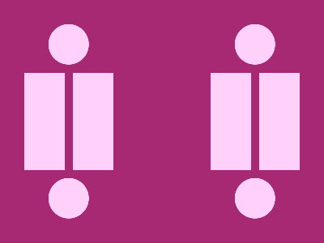

# 🎯 CSS Battle Daily Target: 14/01/2026

  
🎮 [Play Challenge](https://cssbattle.dev/play/dGdurOfM5EDe0pJ3acq7)  
🎥 [Watch Solution Video](https://youtube.com/shorts/v6-KypuUzs0)

---

## 📈 Battle Stats

| 🧩 Metric      | 🔹 Value  |
| :------------- | :-------- |
| **Match**      | ✅ 100%    |
| **Score**      | 🟢 645.97 |
| **Characters** | ✏️ 227    |

---

## 💻 Code

```html
<p><a><b><c>
<style>
*{
  background:#A82973;
  position:fixed
}
  p,a{
    padding:60+25;
    margin:82-38;
    color:FFD0FA;
    box-shadow:63q 0,127q 0
  }
  a{
    margin:-60 205
  }
  b,c{
    padding:25;
    border-radius:50%;
    margin:120 65;
    box-shadow:0-254q,0-53q
  }
  c{
    margin:-25-255
  }
</style>
```

---
