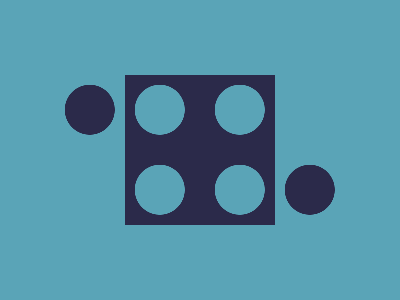

# 🎯 CSS Battle Daily Target: 15/01/2026

  
🎮 [Play Challenge](https://cssbattle.dev/play/43bs10FqWbsJuzqotnbQ)  
🎥 [Watch Solution Video](https://youtube.com/shorts/pAiHQfPZBDs)

---

## 📈 Battle Stats

| 🧩 Metric      | 🔹 Value  |
| :------------- | :-------- |
| **Match**      | ✅ 100%    |
| **Score**      | 🟢 664.17 |
| **Characters** | ✏️ 192    |

---

## 💻 Code

```html
<p><a>
<style>
*{
  background:#5AA4B7;
  *{
    background:#2B2A4A;
    margin:75 125
  }
}
  p,a{
    position:fixed;
    padding:25;
    border-radius:50%;
    margin:10-60;
    color:5AA4B7;
    box-shadow:74q 0,74q 85q
  }
  a{
    scale:-1;
    margin:55 195
  }
</style>
```

---
