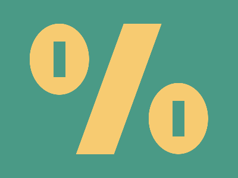

# 🎯 CSS Battle Daily Target: 27/01/2026

  
🎮 [Play Challenge](https://cssbattle.dev/play/128CkPR5NAg3Cx2nUEYj)  
🎥 [Watch Solution Video](https://youtube.com/shorts/u7KFvxrXhRM)

---

## 📈 Battle Stats

| 🧩 Metric      | 🔹 Value  |
| :------------- | :-------- |
| **Match**      | ✅ 100%    |
| **Score**      | 🟢 632.93 |
| **Characters** | ✏️ 262    |

---

## 💻 Code

```html
<p><a><b>
<style>
*{
  background:#4A9A86;
  * *{
    position:fixed;
    padding:60+50;
    margin:32 42;
    color:F7CB71
  }
}
  p,b{
    background:#F7CB71
  }
  p{
    border-radius:50%
  }
  p,a{
    box-shadow:200px 100px
  }
  a{
    padding:30+10;
    margin:-30-10;
    color:4A9A86
  }
  b{
    padding:110+32;
    transform:skew(-20deg);
    margin:-60 68
  }
</style>
```

---
