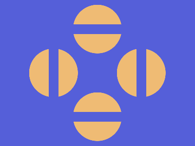

# 🎯 CSS Battle Daily Target: 31/01/2026

  
🎮 [Play Challenge](https://cssbattle.dev/play/MKqHNhQxCf3UBCh7upBb)  
🎥 [Watch Solution Video](https://youtube.com/shorts/zLKuzQQA88o)

---

## 📈 Battle Stats

| 🧩 Metric      | 🔹 Value  |
| :------------- | :-------- |
| **Match**      | ✅ 100%    |
| **Score**      | 🟢 646.85 |
| **Characters** | ✏️ 225    |

---

## 💻 Code

```html
<p><a>
<style>
*{
  background:#555FD9;
  position:fixed
}
  p{
    padding:50;
    border-radius:50%;
    margin:-98 142;
    color:EFBB74;
    box-shadow:0 106q,95q 201q,-95q 201q,0 296q
  }
  a{
    padding:80;
    background:transparent;
    border:22q solid#555FD9;
    margin:90-100
  }
</style>
```

---
