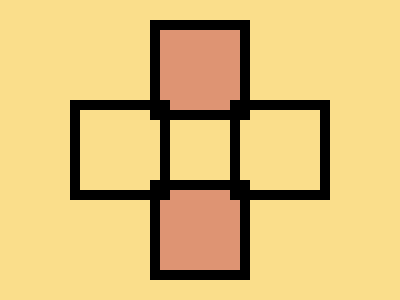

# 🎯 CSS Battle Daily Target: 01/01/2026

  
🎮 [Play Challenge](https://cssbattle.dev/play/LxRezYDIoEbdKZ1KCZsm)  
🎥 [Watch Solution Video](https://youtube.com/shorts/_kC1ks2nH4U)

---

## 📈 Battle Stats

| 🧩 Metric      | 🔹 Value  |
| :------------- | :-------- |
| **Match**      | ✅ 100%    |
| **Score**      | 🟢 664.17 |
| **Characters** | ✏️ 192    |

---

## 💻 Code

```html
<p><a>
<style>
*{
  background:#FADE8B
}
  p,a{
    position:fixed;
    padding:40;
    border:11q solid;
    background:#DE9473;
    margin:12 142;
    -webkit-box-reflect:below 60px
  }
  a{
    background:transparent;
    margin:30;
    rotate:90deg
  }
</style>
```

---
