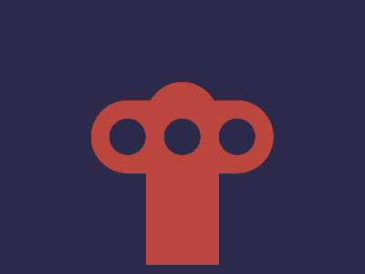

# 🎯 CSS Battle Daily Target: 02/01/2026

  
🎮 [Play Challenge](https://cssbattle.dev/play/Hy5YY324M8yRCQ20oCYb)  
🎥 [Watch Solution Video](https://youtube.com/shorts/RdbgYN4t5pk)

---

## 📈 Battle Stats

| 🧩 Metric      | 🔹 Value  |
| :------------- | :-------- |
| **Match**      | ✅ 100%    |
| **Score**      | 🟢 646.41 |
| **Characters** | ✏️ 226    |

---

## 💻 Code

```html
<p><a>
<style>
*{
  background:#2B2A4A;
  +*,p{
    background:#BA463E;
    margin:90 160 10;
    border-radius:52q 52q 0 0
  }
}
  p,a{
    position:fixed;
    padding:40+100;
    border-radius:52q;
    margin:20-60
  }
  a{
    padding:20;
    margin:-20;
    color:2B2A4A;
    box-shadow:63q 0,-63q 0
  }
</style>
```

---
