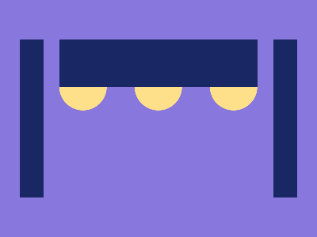

# 🎯 CSS Battle Daily Target: 07/02/2026

  
🎮 [Play Challenge](https://cssbattle.dev/play/qCoyR1NLG3h7xuH0gz8g)  
🎥 [Watch Solution Video](https://youtube.com/shorts/-ZRxXoH4cJc)

---

## 📈 Battle Stats

| 🧩 Metric      | 🔹 Value  |
| :------------- | :-------- |
| **Match**      | ✅ 100%    |
| **Score**      | 🟢 637.63 |
| **Characters** | ✏️ 248    |

---

## 💻 Code

```html
<p><a>
<style>
*{
  background:#8877DC;
  +*,a{
    margin:-25 100;
    border-block:32q solid#192865;
    rotate:90deg
  }
}
  p,a{
    position:fixed
  }
  p{
    padding:30;
    background:#FFE08A;
    border-radius:50%;
    margin:115 30;
    color:FFE08A;
    box-shadow:0 95px,0-95px
  }
  a{
    padding:0 125;
    margin:-30-155
  }
</style>
```

---
