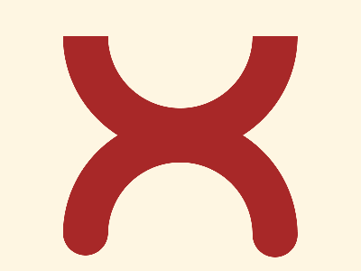

# 🎯 CSS Battle Daily Target: 18/02/2026

  
🎮 [Play Challenge](https://cssbattle.dev/play/BKCI8FncJUntrcTWRTzF)  
🎥 [Watch Solution Video](https://youtube.com/shorts/6OxewmHtz50)

---

## 📈 Battle Stats

| 🧩 Metric      | 🔹 Value  |
| :------------- | :-------- |
| **Match**      | ✅ 100%    |
| **Score**      | 🟢 635.54 |
| **Characters** | ✏️ 254    |

---

## 💻 Code

```html
<p><a>
<style>
*{
  background:#FEF6E2;
  color:A82828;
  +*,p{
    border:53q solid;
    margin:40 70 130;
    border-radius:0 0 137q 137q;
    border-top:0
  }
}
  p,a{
    position:fixed;
    padding:40+80;
    scale:-1;
    margin:90-50
  }
  a{
    padding:25;
    border-radius:50%;
    margin:-65-25;
    box-shadow:111q 0,-111q -2q
  }
</style>
```

---
