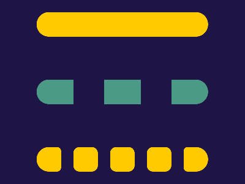

# 🎯 CSS Battle Daily Target: 06/04/2026

  
🎮 [Play Challenge](https://cssbattle.dev/play/QLe0Kvi38Z20upzDCEiK)  
🎥 [Watch Solution Video](https://youtube.com/shorts/uP757Bxkc9s)

---

## 📈 Battle Stats

| 🧩 Metric      | 🔹 Value  |
| :------------- | :-------- |
| **Match**      | ✅ 100%    |
| **Score**      | 🟢 612.94 |
| **Characters** | ✏️ 360    |

---

## 💻 Code

```html
<p><a><b><c>
<style>
*{
  background:#1F1446;
  color:FFCA00;
  +*{
    border-radius:32q;
    margin:90 60 170;
    box-shadow:0 -74q,0 42q#4A9A86;
    *{
      position:fixed
    }
  }
}
  p{
    padding:25;
    margin:30 60;
    box-shadow:116q 0#1F1446
  }
  a,b,c{
    padding:20;
    border-radius:11q;
    background:#FFCA00;
    margin:95 35;
  }
  a{
    box-shadow:63q 0,-63q 0
  }
  b,c{
    border-radius:54q 22q 22q 54q;
    margin:-20-140
  }
  c{
    scale:-1;
    margin:-20 220
  }
</style>
```

---
