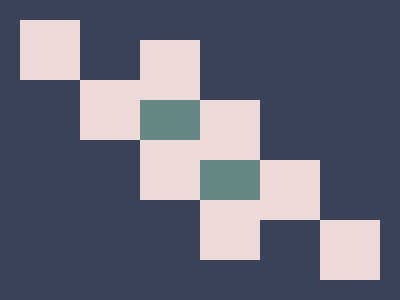

# 🎯 CSS Battle Daily Target: 30/04/2026

  
🎮 [Play Challenge](https://cssbattle.dev/play/mptkoSenO5tTuzn8HfYa)  
🎥 [Watch Solution Video](https://youtube.com/shorts/Irv1-Bp8jmk)

---

## 📈 Battle Stats

| 🧩 Metric      | 🔹 Value  |
| :------------- | :-------- |
| **Match**      | ✅ 100%    |
| **Score**      | 🟢 639.09 |
| **Characters** | ✏️ 244    |

---

## 💻 Code

```html
<p><a>
<style>
*{
  background:#394257;
  *{
    margin:100 80 140 260;
    color:EED9D9;
    box-shadow:-64q 0,0 64q,64q 127q,-127q -63q
  }
}
  p,a{
    position:fixed;
    padding:30;
    scale:-1;
    margin:40-180
  }
  a{
    padding:20+30;
    margin:30-90;
    color:668884;
    box-shadow:0 0 0 22q inset,64q 63q
  }
</style>
```

---
