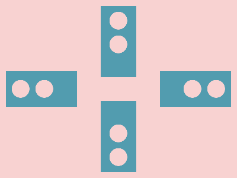

# 🎯 CSS Battle Daily Target: 03/05/2026

  
🎮 [Play Challenge](https://cssbattle.dev/play/ZmI88BYrDPD4PBtlv8j6)  
🎥 [Watch Solution Video](https://youtube.com/shorts/4AQp4ILdtfw)

---

## 📈 Battle Stats

| 🧩 Metric      | 🔹 Value  |
| :------------- | :-------- |
| **Match**      | ✅ 100%    |
| **Score**      | 🟢 623.59 |
| **Characters** | ✏️ 297    |

---

## 💻 Code

```html
<p><a><b>
<style>
*{
  background:#F8D2D1;
  +*,a{
    background:#529CAF;
    margin:120 270 120 10;
    *{
      position:fixed
    }
  }
  +*{
    -webkit-box-reflect:right 148q
  }
  a{
    -webkit-box-reflect:right 42q
  }
}
  p,b{
    padding:15;
    border-radius:50%;
    margin:15 10;
    box-shadow:42q 0#F8D2D1
  }
  a{
    padding:30+60;
    margin:-110 105;
    rotate:90deg
  }
  b{
    margin:-15-50
  }
</style>
```

---
