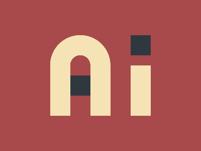

# 🎯 CSS Battle Daily Target: 26/05/2026

  
🎮 [Play Challenge](https://cssbattle.dev/play/mI8Eqyn9sqk49KBAOOKn)  
🎥 [Watch Solution Video](https://youtube.com/shorts/rOht6XVAdz0)

---

## 📈 Battle Stats

| 🧩 Metric      | 🔹 Value  |
| :------------- | :-------- |
| **Match**      | ✅ 100%    |
| **Score**      | 🟢 637.63|
| **Characters** | ✏️ 248    |

---

## 💻 Code

```html
<p><a>
<style>
*{
  background:#A84A4B;
  color:F5E3B5;
  +*{
    border:43q solid;
    border-radius:64q 64q 0 0;
    margin:70 180 70 100;
    border-bottom:0;
    *{
      position:fixed
    }
  }
}
  p{
    padding:50+20;
    box-shadow:127q 4q
  }
  a{
    padding:20;
    margin:24-20;
    color:30383F;
    box-shadow:0-53q,127q -138q
  }
</style>
```

---
